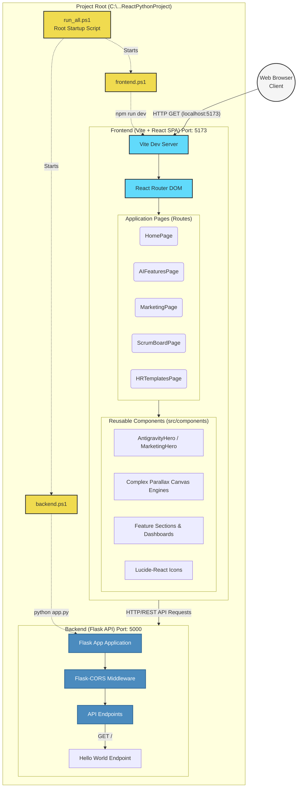

# Anoryx: React & Python Project Architecture

This document outlines the detailed architecture of the Anoryx project, including its frontend presentation layer, backend services, and startup scripts.

## System Architecture Diagram



## Directory Structure

```text
ReactPythonProject/
Γö£ΓöÇΓöÇ run_all.ps1          # Master script to execute both frontend and backend synchronously
Γö£ΓöÇΓöÇ frontend.ps1         # Script to navigate to frontend and start Vite server
Γö£ΓöÇΓöÇ backend.ps1          # Script to establish venv, install Python deps, and run Flask
Γö£ΓöÇΓöÇ frontend/            # React + Vite Framework
Γöé   Γö£ΓöÇΓöÇ package.json     # Node.js dependencies (React, Vite, react-router-dom, lucide-react, canvas tools)
Γöé   Γö£ΓöÇΓöÇ index.html       # Entry point HTML wrapper
Γöé   Γö£ΓöÇΓöÇ vite.config.js   # Vite bundler configuration
Γöé   ΓööΓöÇΓöÇ src/
Γöé       Γö£ΓöÇΓöÇ main.jsx       # Main rendering script wrapping App with BrowserRouter
Γöé       Γö£ΓöÇΓöÇ App.jsx        # Root Layout & BrowserRouter navigation maps
Γöé       Γö£ΓöÇΓöÇ *.jsx          # Higher-level page components (e.g., MarketingPage, ScrumBoardPage)
Γöé       Γö£ΓöÇΓöÇ *.css          # Scoped CSS styles matching page templates
Γöé       Γö£ΓöÇΓöÇ components/    # Reusable section modules (e.g., GoalAlignmentSection.jsx)
Γöé       ΓööΓöÇΓöÇ assets/        # Static images (PNG/SVG) used primarily within components
ΓööΓöÇΓöÇ Backend/             # Python + Flask API
    Γö£ΓöÇΓöÇ app.py           # Core application and API endpoints (currently mapped to localhost:5000)
    ΓööΓöÇΓöÇ venv/            # Python Virtual Environment
```

## Technology Stack
1. **Frontend**: Vite, React (Hooks, Components), `react-router-dom` (SPA mapping), HTML5 Canvas (Complex particle rendering), Vanilla CSS.
2. **Backend**: Python 3, Flask, Flask-CORS (`flask-cors` for cross-origin compliance).
3. **Execution Shell**: PowerShell core (`.ps1` configurations).

## Component Analysis
### 1. The React Frontend
The frontend mimics an advanced suite of tools related to "Anoryx". It is a complex multi-page website utilizing `react-router-dom` to pivot between diverse solutions (Marketing, IT, Scum). Notably, many visual elements leverage HTML5 `<canvas>` through `requestAnimationFrame` loops to construct cinematic "Parallax/Antigravity" starfields, globe lines, and 3D floating nodes directly encoded inside `useEffect` scripts.

### 2. The Python Backend
The backend runs an explicitly lightweight Flask application utilizing `.venv` dependency encapsulation. `CORS(app)` ensures that any REST calls configured within the React Frontend (originating from port `5173`) are openly accepted by port `5000`. Currently acts as a foundational template structure.

### 3. Execution Control
Instead of manual startup, orchestration is completely managed via `.ps1` files. Executing `run_all.ps1` splits execution threads to instantiate `frontend.ps1` and `backend.ps1` in discrete active tracking terminal panes.
